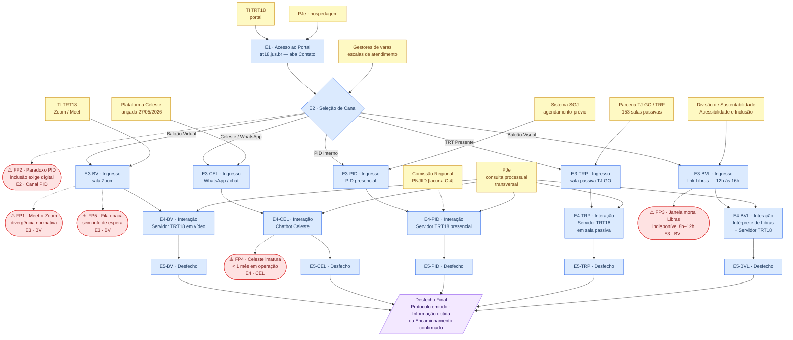

# Diagrama AS-IS — Balcão Virtual TRT18

**Metodologia:** Service Blueprint Shostack | **Base:** C_blueprint_asis.md
**Leitura:** etapas (azul) → atores e processos de suporte (amarelo) → fail points (vermelho) → desfecho (roxo)

---

---

## Legenda

| Cor | Significado |
|---|---|
| Azul | Etapas da jornada (E1–E5) na ótica do cidadão |
| Amarelo | Atores de backstage e processos de suporte |
| Vermelho | Fail points (⚠️ FP1–FP5) — setas tracejadas indicam o ponto de falha |
| Roxo | Desfecho final convergente |

## Leitura do Diagrama

| Elemento | Interpretação |
|---|---|
| Seta sólida `→` | Fluxo normal da jornada ou ação de suporte |
| Seta tracejada `-.->` | Relação de falha potencial ou ator não confirmado [lacuna] |
| Nó de decisão `{ }` | Ponto de bifurcação (E2: seleção de canal) |
| Nó paralelo `[/ /]` | Desfecho convergente (todos os canais chegam aqui) |
| `[lacuna C.4]` | Ator previsto normativamente mas não verificado publicamente |

## Fail Points — Resumo Posicional

| FP | Posição no Diagrama | Canal |
|---|---|---|
| FP1 Meet × Zoom | E3-BV → saída tracejada | Balcão Virtual |
| FP2 Paradoxo PID | E2 → saída tracejada | PID Interno |
| FP3 Janela morta Libras | E3-BVL → saída tracejada | Balcão Visual |
| FP4 Celeste imatura | E4-CEL → saída tracejada | Celeste/WhatsApp |
| FP5 Fila opaca | E3-BV → saída tracejada | Balcão Virtual |
